## AI Concepts Flow

Flowchart shows the journey of intelligence building:

AI (Goal)
+ achieved through Machine Learning (**method**)
+ powered by Neural Networks (**brain**)
+ applied in NLP (**language understanding**)
+ refined by Tokenization, Parsing, Sentiment, Prompting (**communication tools**)
+  trained by Learning Methods (**Supervised**, etc.)
+  evolved into Zero/Few-Shot Learning (**adaptability**)

```mermaid
flowchart TD
    %% === Main Flow ===
    A["🤖 **Artificial Intelligence (AI):** Making machines think and act smartly like humans"]
        --> B["📘 **Machine Learning (ML):** Teaching computers to learn from examples instead of direct instructions"]

    B --> C["🧠 **Neural Networks:** Brain-like systems that help computers think and learn"]
    C --> D["💬 **Natural Language Processing (NLP):** Helps computers understand and use human language"]

    %% === NLP Details ===
    D --> E["✂️ **Tokenization:** Breaking sentences into smaller words or parts"]
    E --> F["🧩 **Parsing:** Understanding sentence structure (who did what)"]
    D --> G["😊 **Sentiment Analysis:** Finding emotions in text (happy, sad, etc.)"]
    D --> H["🗣️ **Prompting:** Giving instructions to guide AI responses"]

    %% === Learning Types ===
    B --> I["👩‍🏫 **Supervised Learning:** Learning from labeled data with correct answers"]
    B --> J["🎲 **Unsupervised Learning:** Finding patterns in data without labels"]
    B --> K["🏆 **Reinforcement Learning:** Learning by trial and error with rewards"]
    B --> L["🌊 **Deep Learning:** Advanced learning using many layers for complex data"]

    %% === Advanced Learning Methods ===
    L --> M["🎮 **Zero-Shot Learning:** Solving new problems never seen before"]
    L --> N["🦓 **Few-Shot Learning:** Learning new things from just a few examples"]

    %% === Example Context ===
    subgraph " "
        A
        B
        C
        D
        E
        F
        G
        H
        I
        J
        K
        L
        M
        N
    end
```

## Artificial Intelligence (AI):

Example: It's like having a smart robot that can play chess or solve puzzles by itself.

Importance: AI is the foundation of everything we'll learn, helping machines think and learn on their own.

## Machine Learning:

Example: Teaching your computer to tell cats from dogs just by looking at pictures.

Importance: This is how computers learn to do things without being explicitly programmed for each task.

## Neural Networks:

Example: Imagine a net made of lights where each light turns on for different thoughts—computers use something similar to think and learn.

Importance: They help computers process information in complex ways, like a brain.

## Natural Language Processing (NLP):

Example: Talking to Siri or Alexa and having them understand and respond.

Importance: NLP lets computers understand and use human language, making it possible to chat with them.

## Tokenization:

Example: Chopping up a sentence into individual words like cutting a string into separate beads.

Importance: This helps computers read and understand texts by breaking them into manageable pieces.

## Sentiment Analysis:

Example: A computer scanning movie reviews to see if people liked the movie or not.

Importance: It allows computers to understand people's feelings from text, useful in many apps.

## Prompting:

Example: Asking an AI to write a story about pirates—your instructions guide what the AI writes.

Importance: Prompting directs the AI to produce specific kinds of responses or content.

## Parsing:

Example: Understanding who is doing what to whom in a sentence.

Importance: It helps AI grasp the structure of sentences to better comprehend text.

## Deep Learning:

Example: Like machine learning but even deeper, teaching a computer to recognize all sorts of animals, not just cats and dogs.

Importance: Enables AI to learn from complex patterns and data.

## Supervised Learning:

Example: Learning with a teacher who shows you pictures of animals and tells you their names.

Importance: It’s a main way to teach AI specific tasks with clear examples.

## Unsupervised Learning:

Example: Sorting out a mixed box of toys into groups without knowing what each toy is called.

Importance: Helps AI discover patterns on its own, useful when we don’t have all the answers.

## Reinforcement Learning:

Example: Teaching a robot to walk by rewarding it when it takes steps without falling.

Importance: Useful for teaching AI through trial and error, especially when the right moves aren’t clear.

## Zero-shot Learning:

Example: Teaching a computer a new game it has never seen before and it figuring out how to play.

Importance: Enables AI to tackle completely new tasks using what it has learned before.

## Few-shot Learning:

Example: Teaching a computer to recognize zebras by showing it only a few pictures.

Importance: Allows AI to quickly learn new things from very little data.
