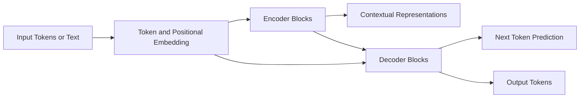

# Transformer, BERT, GPT – Unified Overview

## Unified Architecture Flow

Transformer Model explained very well - https://www.skills.google/paths/183/course_templates/538/video/583546

---

* **Transformer (Encoder–Decoder)**: Uses both encoder and decoder blocks (e.g., translation models)
* **BERT**: Uses **only the encoder stack** to produce deep contextual representations
* **GPT / ChatGPT**: Uses **only the decoder stack** to predict the next token autoregressively

---

## Overview

This document explains the relationship between **Transformer architecture**, **BERT**, **GPT**, and **LLMs**, and why they are differentiated despite sharing the same foundational design.

---

## Transformer Architecture

* Transformer is a **neural network architecture**, not a model
* Introduced self-attention to replace RNNs
* Can be configured as:

  * Encoder-only
  * Decoder-only
  * Encoder–Decoder

All modern language models are built on this architecture.

---

## BERT

* Built using **encoder-only transformers**
* Uses **bidirectional self-attention**
* Trained using **Masked Language Modeling (MLM)**
* Designed for **language understanding**, not generation

### Best Use Cases

* Text classification
* Semantic search
* Question answering
* Information extraction

BERT is transformer-based, but **not typically classified as an LLM**.

---

## GPT / ChatGPT

* Built using **decoder-only transformers**
* Uses **causal (unidirectional) attention**
* Trained via **next-token prediction**
* Generates text **one token at a time**

### Best Use Cases

* Chatbots
* Content generation
* Code generation
* Summarization

ChatGPT = GPT + instruction tuning + RLHF

---

## LLMs (Large Language Models)

An LLM is defined by:

* Transformer-based architecture
* Very large parameter count
* Massive pretraining data
* General-purpose language capability

### Examples

* GPT-4
* Gemini
* Claude
* LLaMA

> All LLMs are transformers, but not all transformers are LLMs.

---

## Key Takeaways

* **Transformer** is the architectural foundation
* **BERT** optimizes transformers for understanding
* **GPT** optimizes transformers for generation
* **LLMs** are large-scale, generative transformer models

---

## One-Line Summary

> Transformers define the architecture, BERT specializes it for understanding, and GPT scales it for generation in modern LLMs.
