# 🚗 Car Activity Transformer

This project is a **Car Activity Recognition system** using a **Transformer-based deep learning model**. It predicts car activities (e.g., idle, moving, neutral, parked) from telemetry data such as speed, RPM, throttle, brake, acceleration, and gear.

---

## **Table of Contents**

* [Features](#features)
* [Project Structure](#project-structure)
* [Requirements](#requirements)
* [Installation](#installation)
* [Usage](#usage)
  * [Training the Model](#training-the-model)
  * [Running the App](#running-the-app)
* [Data Format](#data-format)
* [Model Architecture](#model-architecture)


---

## **Features**

* Transformer-based sequence model for time-series classification
* Handles multiple car telemetry features
* Streamlit web app for uploading CSVs and visualizing predictions
* Generates activity timeline charts
* Fully compatible with Keras `.keras` and legacy H5 models


### **High-Level Architecture**

```mermaid
---
config:
  layout: default
---
%% title: Car Activity Recognition System - High-Level Architecture
flowchart LR
    style A fill:#f9f,stroke:#333,stroke-width:2px
    style B fill:#f9f,stroke:#333,stroke-width:2px
    style C fill:#f9f,stroke:#333,stroke-width:2px
    style D fill:#ffcc00,stroke:#333,stroke-width:2px
    style E fill:#66ccff,stroke:#333,stroke-width:2px
    style F fill:#99ff99,stroke:#333,stroke-width:2px
    style G fill:#99ff99,stroke:#333,stroke-width:2px

    A[Car Telemetry Data] --> B[Data Preprocessing]
    B --> C[Sequence Windowing & Scaling]
    C --> D[Transformer Model]
    D --> E[Prediction Output]
    E --> F[Streamlit Web Interface]
    F --> G[User Views Predicted Activities & Timeline]

    subgraph Data Layer
        A
        B
        C
    end

    subgraph AI/ML Layer
        D
    end

    subgraph Serving Layer
        E
    end

    subgraph UI Layer
        F
        G
    end

    classDef note fill:#fff3cd,stroke:#f0ad4e,stroke-width:1px, font-size:12px
    class A,B,C,D,E,F,G note
```



---

## **Project Structure**

```
car-activity-transformer/
│
├── app.py                   # Streamlit web application
├── requirements.txt         # Python dependencies
├── README.md
├── experiments/             # Trained model checkpoints
│   ├── best_model.h5
│   └── final_model.keras
├── data/
│   ├── raw/                 # Raw CSV session files
│   └── processed/           # Scaler and label encoder
├── src/
│   ├── model.py             # Transformer model and Positional Encoding
│   ├── preprocess.py        # Preprocessing, windowing, scaling utilities
│   └── train.py             # Model training script
```

---

## **Requirements**

* Python 3.10+
* TensorFlow 2.15+
* pandas
* numpy
* scikit-learn
* joblib
* streamlit

---

## **Installation**

1. Clone the repository:

2. Create a virtual environment (optional but recommended):

```bash
conda create -n car_tf python=3.10
conda activate car_tf
```

3. Install dependencies:

```bash
pip install -r requirements.txt
```

---

## **Usage**

### **1. Training the Model**

If you have raw CSV telemetry data:

```bash
python -m src.train
```

* This will:

  * Load CSVs from `data/raw/`
  * Preprocess and create sliding windows
  * Train the Transformer model
  * Save the model in `experiments/final_model.keras`
  * Save scaler and label encoder in `data/processed/`

If no CSVs are present, a **dummy dataset** will be generated automatically.

---

### **2. Running the Streamlit App**

```bash
streamlit run app.py
```

* Open your browser at the URL shown in the terminal.
* Upload a CSV with car telemetry.
* The app will:

  * Preprocess the data
  * Make predictions for each sliding window
  * Display a table of predicted activities
  * Show an activity timeline chart

---

## **Data Format**

The CSV file should have the following columns:

| Column    | Type     | Description                            |
| --------- | -------- | -------------------------------------- |
| timestamp | datetime | Timestamp of telemetry reading         |
| speed     | float    | Vehicle speed                          |
| rpm       | float    | Engine RPM                             |
| throttle  | float    | Throttle position                      |
| brake     | float    | Brake value                            |
| accel_x   | float    | Acceleration in X axis                 |
| accel_y   | float    | Acceleration in Y axis                 |
| gear      | int      | Current gear                           |
| label     | string   | (Optional for training) Activity label |

* For inference in the Streamlit app, the `label` column is not required.

---

## **Model Architecture**

* Transformer Encoder with:

  * Multi-Head Attention
  * Feed-Forward Network
  * Positional Encoding
* Global Average Pooling for sequence aggregation
* Optional MLP on top
* Softmax output layer for multi-class classification

---
