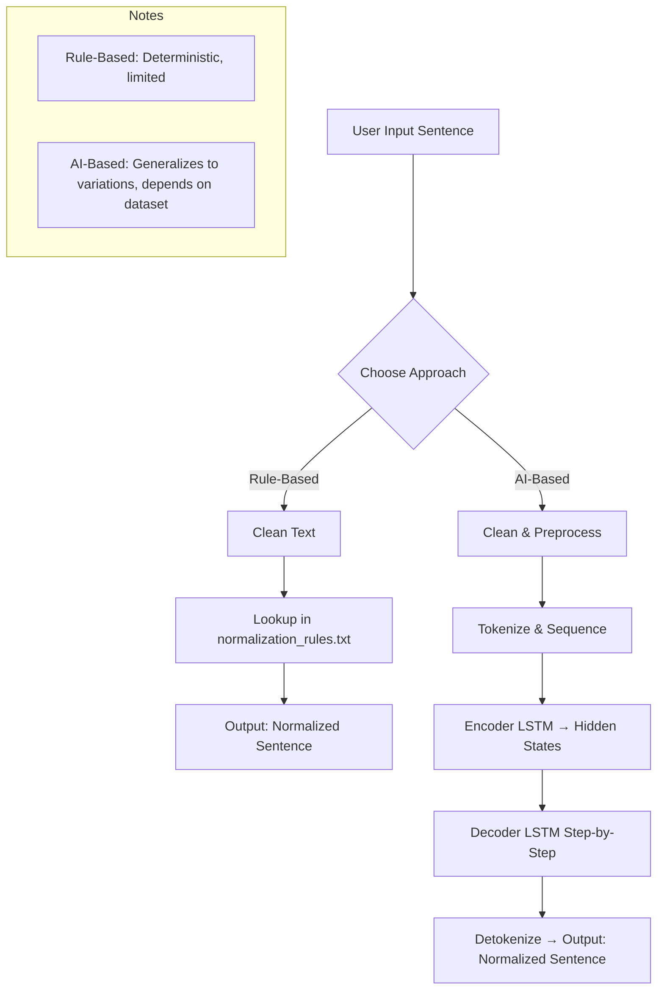

# Concepts & Learnings – German Text Normalizer

## Concepts Covered

### 1. Rule-Based Normalization

* Uses a **predefined set of rules** to correct text.
* **Workflow:**
  `Input → Clean → Lookup → Output`
  Example: `"ich bin muede"` → lookup → `"Ich bin müde"`
* **Pros:**

  * Deterministic and fast.
  * No training or large dataset required.
* **Cons:**

  * Cannot generalize beyond the rules.
  * Only works for exact matches in the dataset.

### 2. AI-Based Normalization (Seq2Seq LSTM)

* Uses **encoder-decoder architecture** with **LSTM layers** to learn sequence-to-sequence mapping.
* **Workflow:**
  `Input → Preprocess → Tokenize → Encode → Decode → Detokenize → Output`
* **Steps:**

  1. Input sentence is cleaned and lowercased.
  2. Tokenized and converted to sequences.
  3. Encoder LSTM generates hidden states representing the input.
  4. Decoder LSTM predicts the output word by word until `<eos>` token.
  5. Output tokens are converted back to a readable sentence.
* **Pros:**

  * Can generalize to variations of known words.
  * Demonstrates sequence-to-sequence modeling for NLP.
* **Cons:**

  * Requires a dataset and training.
  * May produce incorrect outputs for completely unseen words.

### 3. Key Concepts Applied

* **Text preprocessing:** Lowercasing, stripping extra spaces.
* **Tokenization:** Converting text to sequences of integers.
* **Encoder-Decoder LSTM:** Learning input-to-output mapping.
* **Inference pipeline:** Using trained model to predict normalized text.
* **Rule vs AI comparison:** Rule-based is precise but limited; AI-based is flexible but depends on training data.

### 4. Limitations

* AI model may produce incorrect results for words **not in the dataset** or rare variants.
* Both approaches are primarily **learning experiments**, demonstrating workflow rather than a fully production-ready solution.

### 5. Learning Outcome

* Hands-on understanding of **rule-based vs AI-based NLP workflows**.
* Exposure to **sequence-to-sequence modeling**.
* Understanding importance of **data quality and model generalization** in NLP tasks.

---

## Overall Workflow Diagram

