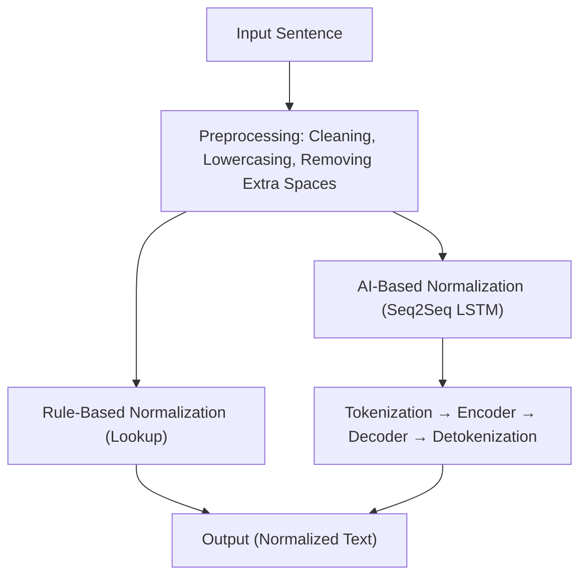
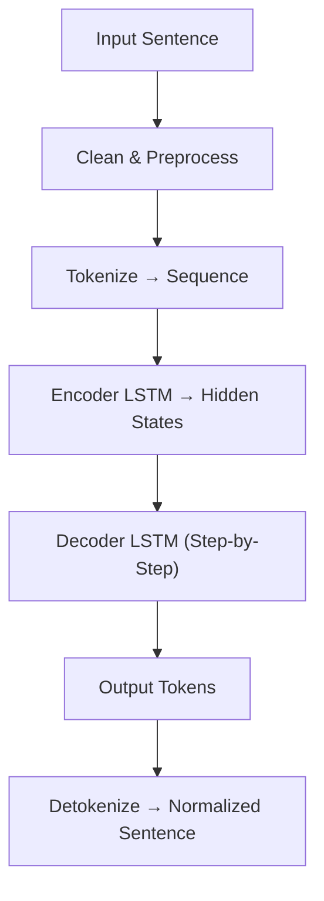

# German Text Normalizer

This project explores **Natural Language Processing (NLP)** using both **rule-based** and **AI-based** methods, focusing on a beginner-friendly **German text normalization use-case**: correcting `"ich bin muede"` → `"Ich bin müde"`. This project is primarily educational, showcasing how AI can be applied to text normalization, including tokenization, LSTM encoding/decoding, and simple mapping from misspellings to correct text.
While it works for the small experimental dataset, real-world German normalization would require more comprehensive datasets and advanced NLP pipelines.


---

## NLP Concepts Flow

Flowchart shows how NLP works and the journey from raw text to intelligent normalization.



**Explanation:**

1. Text is first cleaned and preprocessed.
2. **Rule-based normalization** uses a lookup table (`normalization_rules.txt`) to correct known phrases.
3. **AI-based normalization** uses a Seq2Seq LSTM model to generalize beyond predefined rules.
4. Both approaches produce normalized output text.

---

## 1. Rule-Based Normalization (Non-AI)

**Flow:**

```
Input → Clean → Lookup → Output
Example: "ich bin muede" → lookup → "Ich bin müde"
```

**Pros:**

* Simple and deterministic
* Tiny dataset
* Fast, no training required

**Cons:**

* Cannot generalize beyond predefined rules
* Cannot handle unseen variations

**Implementation:**

* Preprocess text (lowercase, strip spaces)
* Check `normalization_rules.txt` for a match
* Return corrected sentence

**Example:**

```
Input: "ich bin muede"
Output: "Ich bin müde"
```

---

## 2. AI-Based Normalization (Seq2Seq LSTM)

**Flowchart:**



**Explanation:**

1. Input is tokenized and padded into sequences.
2. Encoder LSTM produces hidden states representing the sentence.
3. Decoder LSTM predicts words one at a time until `<eos>` token.
4. Output tokens are converted back into readable text.

**Pros:**

* Can generalize to unseen sentences
* Learns patterns beyond exact rules

**Cons:**

* Needs a small training dataset
* Slightly slower than rule-based method

**Example:**

```
Input: "ich bin muede"
Output: "Ich bin müde"

Input: "hunger"
Output: "Hunger" (generalized prediction)
```

---

## NLP Pipeline Components

| Component      | Purpose                         | Example                                  |
| -------------- | ------------------------------- | ---------------------------------------- |
| Preprocessing  | Clean text, remove extra spaces | `"ich  bin   muede"` → `"ich bin muede"` |
| Tokenization   | Convert words to integers       | `"ich bin"` → `[1, 2]`                   |
| Encoder LSTM   | Understand sentence context     | Generates hidden states                  |
| Decoder LSTM   | Predicts normalized sentence    | Outputs one word at a time               |
| Detokenization | Convert token ids back to words | `[1, 2, 3]` → `"Ich bin müde"`           |

---

## Comparison: Rule-Based vs AI-Based

| Feature        | Rule-Based | AI-Based (Seq2Seq)                    |
| -------------- | ---------- | ------------------------------------- |
| Dataset Size   | Tiny       | Small to medium                       |
| Training       | None       | Required                              |
| Generalization | No         | Yes                                   |
| Speed          | Very fast  | Slightly slower                       |
| Complexity     | Low        | Moderate (requires LSTM & tokenizers) |

---

## How to Run

### 1. Install Dependencies

```bash
pip install -r requirements.txt
```

### 2. Train AI Model (first time)

```bash
python src/train.py
```

### 3. Run CLI for Normalization

```bash
python src/main.py
```

**Example:**

```
Enter a sentence: ich bin muede
Normalized: Ich bin müde
```

---

## How to Extend

1. Add more rules in `data/normalization_rules.txt` for rule-based normalization.
2. Add more examples to train the AI model for better generalization.
3. Use `main.py` to test new sentences.

---
