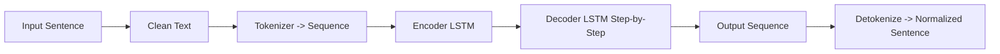

# German Text Normalizer (AI Version)

A beginner-friendly AI-based text normalizer for German.
Currently, it supports **one use-case**: correcting `"ich bin muede"` → `"Ich bin müde"` using a **Seq2Seq model**.

---

## Features

* AI-based normalization using **Encoder-Decoder LSTM**.
* Tokenization, encoding, and decoding for sentence correction.
* Lightweight, beginner-friendly dataset.
* CLI interface for live testing.

---

## Project Structure

```
german-text-normalizer-ai/
├── data/
│   └── normalization_rules.txt   # Small dataset for training
├── models/
│   ├── seq2seq_model.keras       # Trained AI model
│   ├── src_tokenizer.pkl         # Source tokenizer
│   └── tgt_tokenizer.pkl         # Target tokenizer
├── src/
│   ├── preprocessing.py          # Text cleaning and padding
│   ├── train.py                  # Training script
│   ├── inference.py              # Load model & inference functions
│   └── main.py                   # CLI script for testing
├── requirements.txt
└── README.md
```

---

## Architecture

### AI-Based Seq2Seq Pipeline



**Explanation:**

1. Input sentence is **cleaned** (lowercased, extra spaces removed).
2. Tokenized and **padded** into sequences.
3. **Encoder LSTM** processes the input and produces hidden states.
4. **Decoder LSTM** predicts the output word-by-word until `<eos>` token.
5. Output tokens are converted back into a **readable sentence**.

---

### Comparison: Non-AI vs AI

**Non-AI (Rule-Based)**

```
Input → Clean → Lookup → Output
Example: "ich bin muede" → lookup → "Ich bin müde"
```

**Pros:**

* Deterministic
* Tiny dataset
* No training required

**Cons:**

* Cannot generalize beyond predefined rules
* No embeddings or LSTM

**AI-Based (Seq2Seq)**

```
Input → Clean → Tokenize → Encode → Decode → Output
```

**Pros:**

* Can generalize beyond exact rules
* Introduces a real **ML/AI pipeline**
* Step-by-step decoding for flexible outputs

**Cons:**

* Requires a small dataset & training
* Slightly slower than rule-based approach

---

## How to Run

### 1. Install dependencies

```bash
pip install -r requirements.txt
```

### 2. Train the AI model (first time)

```bash
python src/train.py
```

### 3. Run CLI for live normalization

```bash
python src/main.py
```

**Example:**

```
=== German Text Normalizer (AI) ===
Type 'exit' to quit.

Enter a sentence: ich bin muede
Normalized: Ich bin müde
```

---

## How to Extend

1. Add more sentences to `data/normalization_rules.txt`.
2. Re-run `train.py` to **update the AI model**.
3. Use `main.py` to test new sentences.

---

## Notes

* Designed for **one-use-case** demo (can extend to more rules).
* Encoder-Decoder LSTM handles **sequence-to-sequence learning**.
* Tokenization uses Keras `Tokenizer`.
* Output is **deterministic** for this small dataset.
