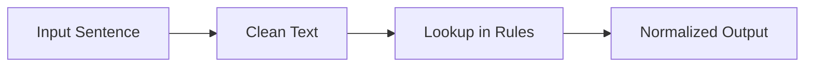
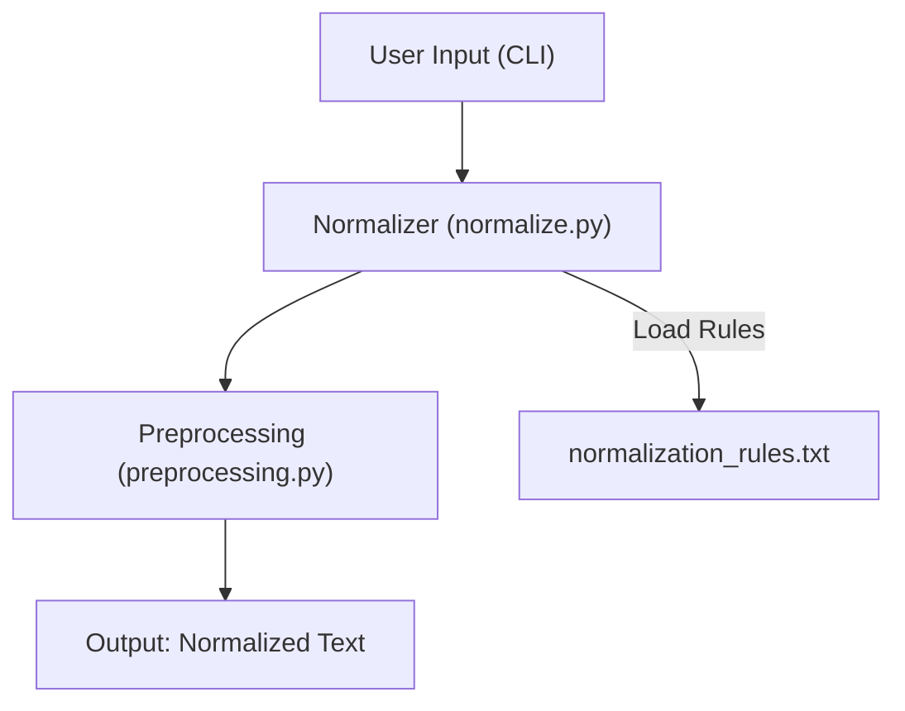

# German Text Normalizer (Beginner Version)

This is a **simple, beginner-friendly text normalizer for German**.

### **Non-AI (Rule-Based)**

- **Pipeline:** `Input → Clean → Lookup → Output`  


---

## Architecture Overview



* **normalize.py**: Core logic; reads `normalization_rules.txt` and applies corrections.
* **preprocessing.py**: Cleans input text (lowercase, remove extra spaces).
* **main.py**: CLI interface; user enters a sentence, receives normalized output.
* **data/normalization_rules.txt**: Contains mapping from "bad" → "correct" sentences.

---

## Project Structure

```
german-text-normalizer/
├── data/
│   └── normalization_rules.txt  # Rules for normalization
├── src/
│   ├── preprocessing.py          # Text cleaning utilities
│   ├── normalize.py              # Core Normalizer class
│   ├── main.py                   # CLI for demo
├── requirements.txt
└── README.md
```

---

## Features

* Corrects specific German sentences based on **simple rules**.
* Beginner-friendly, no AI/ML required.
* Easy to extend: add more rules to `data/normalization_rules.txt`.
* Handles:

  * Extra spaces
  * Lowercasing
  * Basic punctuation stripping

---

## Usage

Run the CLI:

```bash
python src/main.py
```

Example session:

```
German Text Normalizer (Beginner Version)
Type 'exit' to quit.

Enter a sentence: ich bin muede
Output: Ich bin müde
```

---

## Adding New Rules

1. Open `data/normalization_rules.txt`.
2. Add a new line in the format:

```
bad sentence ||| correct sentence
```

Example:

```
bin muede ||| Ich bin müde
hallo zusammen ||| Hallo zusammen
```

3. Save the file; the next time you run `main.py`, it will automatically use the new rules.

---

* This is **not AI-based**; it uses **exact string matching**.
* Works best for **fixed phrases** or **commonly mistyped sentences**.
* To handle more variations, simply add more rules.
