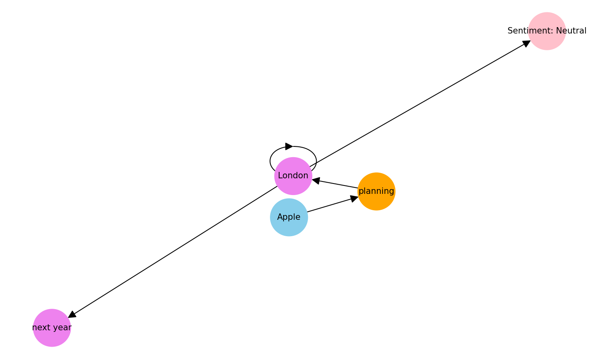
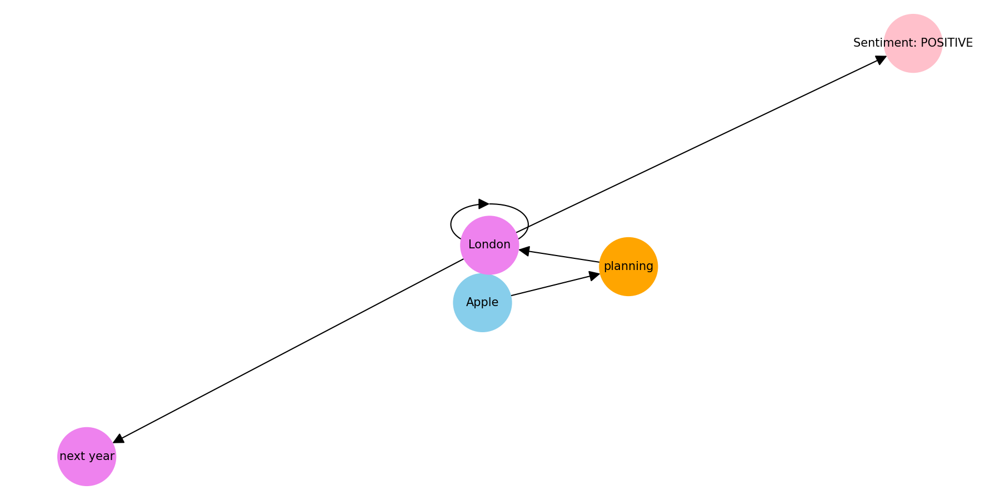

# Opinion Map - NLP Visualization

This project demonstrates how to create an **Opinion Map** from a sentence using **spaCy**, **NetworkX**, and either **TextBlob** or **Hugging Face Transformers** for sentiment analysis. The opinion map visually represents the relationships between entities, actions, objects, context, and sentiment.


---

## Features

- **Named Entity Recognition (NER)**: Extracts entities such as organizations, locations, and dates.
- **Dependency Parsing**: Identifies the main action (verb) and objects.
- **Context Extraction**: Captures location and time references.
- **Sentiment Analysis**:
  - **TextBlob**: Lexicon-based sentiment (positive/neutral/negative).
  - **Transformer (DistilBERT)**: Context-aware sentiment (positive/negative) using PyTorch.
- **Graph Visualization**: Uses NetworkX and Matplotlib to visualize the opinion map.

---

## Files

1. **TextBlob Version**: `opinion_map_textblob.py`
   - Uses TextBlob for sentiment analysis.
   - Fast and lightweight, but less context-aware.

2. **Transformer Version**: `opinion_map_transformer.py`
   - Uses Hugging Face DistilBERT with PyTorch.
   - Captures nuanced sentiment with contextual understanding.

---

## Requirements

- Python 3.8+
- Libraries:
  - spaCy
  - textblob (for TextBlob version)
  - transformers, torch (for Transformer version)
  - networkx
  - matplotlib

### Install Dependencies
```bash
pip install spacy textblob transformers torch networkx matplotlib
python -m spacy download en_core_web_sm
```

---

## Usage

### TextBlob Version
```bash
python opinion_map_textblob.py
```
- Computes sentiment using TextBlob.
- Generates a visual opinion map.

### Transformer Version
```bash
python opinion_map_transformer.py
```
- Computes context-aware sentiment using DistilBERT.
- Forces PyTorch framework to avoid TensorFlow/Keras issues.
- Generates a visual opinion map.

---

## Example Input
```text
Apple is planning to open a new office in London next year.
```

### Example Output (TextBlob)



```
Sentiment: Neutral
```

### Example Output (Transformer)



```
Sentiment: POSITIVE
```

Nodes are color-coded:
- Skyblue: Entities
- Orange: Actions
- Light Green: Objects
- Violet: Context (Location/Time)
- Pink: Sentiment

---

## Notes
- Use **TextBlob** for quick analysis on small datasets.
- Use **Transformer** for nuanced sentiment detection on context-rich text.
- Both scripts generate the same opinion map structure, differing only in sentiment analysis approach.

---
